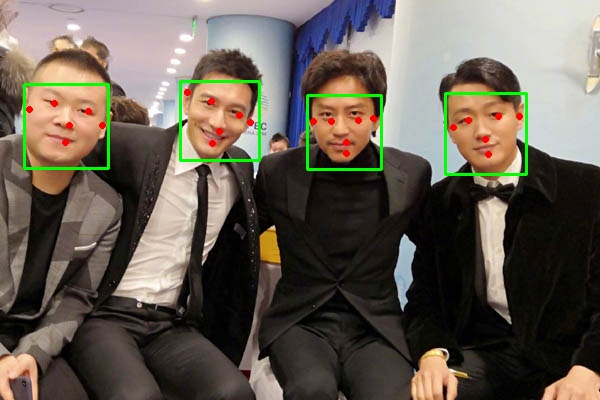
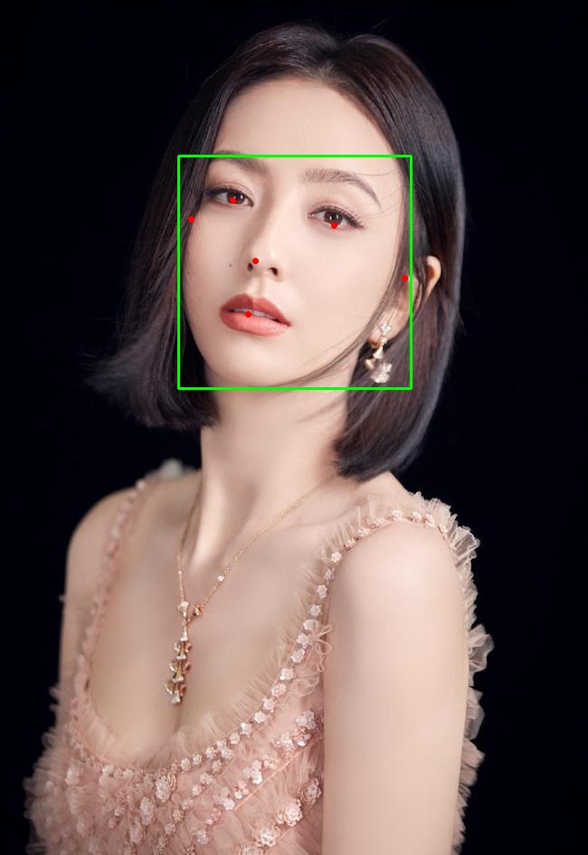

# Facepipe
人脸相关类API，用于测试CMIT统一AI平台的部署；使用[mediapipe](https://github.com/google/mediapipe)检测人脸和面部的**468**个关键特征点

<table>
  <tr>
     <td align="center">原图</td>
     <td align="center">人脸检测</td>
     <td align="center">人脸468关键点检测</td>
  </tr>
  <tr>
    <td></td>
    <td></td>
    <td></td>
  </tr>
</table>

- [部署说明](#部署说明)
- [接口说明](#接口说明)
    - [人脸检测接口](#人脸检测接口)
    - [人脸468关键点检测](#人脸468关键点检测)


## 部署说明
1. clone项目到本地
2. 参照`./.env_example`在项目根目录创建`.env`文件，在`.env`文件中设置环境变量，下面是项目中自带一个.env文件，如果懒的话，可以只替换一下`SECRET_KEY`

```
APP_CONFIG=production #部署环境：production-生产环境;development-开发环境；testing-测试环境
SECRET_KEY=fadfascsvarw22wxvZf    # 墙裂建议生产部署的适合替换SECRET_KEY
```
3. 在项目根目录执行`docker-composer up -d`即可


## 接口说明
项目提供**人脸检测**:`/api/v1/face/detect`和**人脸468个特征点检测**:`/api/v1/face/landmark`两个接口，接口调用说明如下。
### 人脸检测接口
检测图像中人脸区域和6个关键特征点，检测效果如下图所示:

<table>
  <tr>
     <td align="center">原图</td>
     <td align="center">人脸检测</td>
  </tr>
  <tr>
    <td></td>
    <td></td>
  </tr>
</table>

#### 请求示例
```bash
curl --location --request POST 'http://127.0.0.1:5000/api/v1/face/detect' \
--header 'Content-Type: application/json' \
--data-raw '{
    "image":"图像base64编码"
}'
```

#### 返回结果示例
```json
{"code": 200, "error": null, "faces": [{"bbox": {"xmin": 196, "ymin": 171, "width": 258, "height": 258}, "keypoints": [[257, 221], [368, 249], [282, 288], [273, 347], [211, 241], [447, 307]]}]}
```

#### 调用说明

- 接口地址:`/api/v1/face/detect`
- 请求方式:**POST**
- 请求参数说明

参数 | 类型 | 是否必填 | 参数说明
:----- | :----- | :----- | :-----
image | base64 str | 是 | 用于检测的图像，使用Base64对图像进行编码；目前仅支持通道为1、3、4的图像；
- 返回结果

字段 | 类型 | 是否必有 | 参数说明
:----- | :----- | :----- | :-----
code | int | 是 | api请求结果状态码：200:请求成功；4100-4105:请求参数有误；5300:服务端错误；
error | str/null | 是 | 请求失败的具体错误信息；当请求成功时为null
faces | array| 否| 只有当检测成功的时候才会返回该字段

### 人脸468关键点检测
检测人脸的**468**个关键特征点，检测效果如下图所示:

<table>
  <tr>
     <td align="center">原图</td>
     <td align="center">人脸468关键特征点检测</td>
  </tr>
  <tr>
    <td></td>
    <td></td>
  </tr>
</table>

#### 请求示例
```bash
curl --location --request POST 'http://127.0.0.1:5000/api/v1/face/landmark' \
--header 'Content-Type: application/json' \
--data-raw '{
    "image":"图像base64编码"
}'
```

#### 返回结果示例
```json
{"code": 200, "error": null, "landmarks": [[[277, 328], [283, 288], [284, 303], [286, 253], [285, 276], [290, 263], [303, 232], [240, 218], [311, 201], [315, 185], [329, 135], [276, 334], [276, 340], [276, 343], [275, 350], [273, 355], [271, 362], [270, 369], [271, 378], [283, 295], [278, 294], [227, 173], [264, 234], [254, 233], [246, 230], [236, 221], [273, 232], [259, 199], [269, 203], [249, 198], [242, 202], [228, 227], [237, 383], [238, 214], [212, 220], [222, 218], [246, 276], [267, 325], [267, 338], [257, 327], [250, 332], [261, 338], [255, 339], [237, 349], [276, 286], [276, 275], [232, 186], [271, 253], [261, 283], [262, 278], [219, 271], [281, 263], [254, 176], [241, 178], [237, 153], [291, 194], [277, 209], [233, 337], [207, 325], [267, 291], [274, 296], [243, 340], [249, 341], [239, 170], [261, 289], [269, 180], [270, 171], [274, 131], [238, 161], [272, 151], [229, 181], [228, 178], [267, 332], [259, 333], [252, 335], [269, 294], [246, 341], [247, 344], [250, 340], [270, 286], [259, 340], [263, 340], [269, 341], [259, 375], [259, 365], [261, 358], [264, 352], [266, 347], [255, 344], [253, 345], [250, 347], [247, 351], [246, 317], [209, 270], [284, 298], [253, 343], [250, 343], [275, 301], [264, 297], [274, 299], [260, 257], [242, 262], [260, 283], [252, 139], [252, 152], [252, 167], [242, 358], [291, 178], [294, 155], [298, 130], [239, 226], [217, 234], [279, 230], [233, 204], [279, 246], [265, 279], [208, 240], [219, 242], [229, 249], [247, 250], [262, 248], [273, 245], [293, 233], [203, 263], [227, 201], [279, 293], [269, 263], [216, 221], [282, 240], [260, 285], [235, 214], [267, 272], [207, 297], [281, 226], [274, 266], [211, 352], [213, 365], [202, 266], [205, 336], [220, 197], [235, 392], [281, 297], [260, 270], [216, 219], [247, 224], [255, 227], [244, 345], [202, 286], [249, 411], [229, 391], [221, 380], [321, 161], [267, 418], [264, 228], [272, 227], [277, 227], [223, 198], [274, 218], [267, 213], [258, 211], [250, 210], [244, 212], [220, 195], [242, 221], [282, 311], [255, 312], [266, 289], [271, 310], [308, 217], [219, 368], [226, 379], [247, 404], [209, 348], [279, 223], [282, 249], [266, 411], [237, 401], [200, 291], [260, 345], [257, 348], [254, 352], [251, 358], [249, 366], [252, 340], [248, 338], [246, 336], [238, 326], [210, 294], [286, 239], [289, 218], [284, 219], [255, 339], [208, 321], [296, 217], [242, 374], [294, 252], [289, 243], [298, 243], [272, 264], [267, 401], [269, 389], [254, 384], [228, 351], [251, 292], [234, 364], [229, 287], [239, 302], [220, 304], [249, 394], [267, 271], [221, 357], [229, 370], [224, 336], [203, 306], [215, 335], [201, 314], [230, 316], [276, 256], [267, 284], [263, 287], [270, 276], [283, 205], [269, 194], [256, 190], [245, 190], [238, 195], [230, 216], [206, 242], [230, 233], [238, 238], [251, 241], [263, 241], [274, 239], [281, 236], [213, 246], [264, 291], [278, 257], [271, 284], [276, 291], [272, 287], [266, 296], [277, 292], [279, 296], [284, 227], [288, 230], [289, 232], [240, 213], [237, 206], [303, 256], [387, 250], [293, 297], [446, 218], [353, 253], [364, 257], [375, 258], [391, 255], [345, 248], [373, 222], [361, 221], [384, 226], [391, 233], [399, 265], [308, 402], [392, 248], [439, 269], [414, 259], [345, 299], [289, 330], [285, 342], [301, 338], [309, 346], [294, 346], [301, 350], [321, 370], [291, 290], [295, 279], [412, 224], [332, 266], [317, 296], [321, 292], [381, 308], [299, 266], [386, 202], [401, 211], [436, 193], [336, 203], [350, 223], [330, 361], [406, 374], [308, 301], [299, 302], [317, 358], [313, 356], [410, 205], [317, 303], [365, 199], [368, 190], [391, 153], [423, 199], [378, 171], [421, 221], [433, 220], [287, 337], [297, 343], [305, 348], [305, 303], [315, 357], [310, 359], [312, 355], [304, 294], [300, 350], [293, 347], [285, 345], [285, 381], [283, 371], [284, 364], [284, 357], [284, 352], [301, 355], [303, 357], [304, 361], [306, 366], [322, 336], [434, 322], [306, 356], [308, 357], [295, 306], [312, 309], [297, 304], [342, 276], [358, 288], [322, 298], [418, 171], [405, 182], [392, 194], [311, 376], [342, 188], [351, 165], [362, 142], [385, 258], [409, 276], [339, 243], [404, 241], [325, 256], [312, 289], [421, 287], [398, 282], [382, 283], [361, 276], [346, 267], [336, 259], [313, 237], [412, 311], [414, 241], [288, 295], [326, 276], [448, 272], [328, 250], [324, 300], [396, 249], [315, 283], [423, 348], [340, 239], [307, 274], [365, 392], [366, 405], [428, 318], [385, 381], [437, 244], [309, 413], [287, 298], [334, 287], [425, 264], [375, 251], [365, 250], [313, 362], [404, 333], [288, 422], [326, 418], [344, 414], [356, 247], [348, 244], [343, 241], [424, 241], [351, 234], [360, 233], [370, 234], [379, 238], [385, 242], [450, 243], [382, 251], [313, 326], [309, 298], [295, 316], [345, 402], [328, 408], [288, 415], [386, 393], [343, 236], [315, 256], [307, 421], [418, 342], [294, 354], [294, 357], [295, 363], [296, 370], [299, 380], [308, 354], [311, 353], [315, 352], [328, 348], [384, 335], [319, 246], [333, 227], [339, 231], [306, 352], [379, 362], [322, 222], [305, 391], [307, 247], [317, 275], [286, 393], [332, 377], [331, 311], [320, 386], [359, 317], [339, 325], [364, 338], [288, 405], [322, 283], [342, 388], [325, 396], [343, 365], [396, 352], [360, 371], [405, 363], [343, 343], [320, 266], [307, 293], [313, 299], [304, 283], [344, 217], [362, 213], [378, 215], [391, 220], [400, 229], [404, 254], [435, 294], [391, 268], [378, 269], [363, 265], [350, 259], [340, 253], [333, 247], [442, 297], [312, 303], [311, 264], [299, 290], [293, 295], [299, 293], [309, 306], [291, 295], [290, 299], [336, 238], [329, 239], [324, 239], [388, 245], [397, 240]]]}
```

#### 调用说明

- 接口地址:`/api/v1/face/landmark`
- 请求方式:**POST**
- 请求参数说明

参数 | 类型 | 是否必填 | 参数说明
:----- | :----- | :----- | :-----
image | base64 str | 是 | 用于检测的图像，使用Base64对图像进行编码；目前仅支持通道为1、3、4的图像；

- 返回结果

字段 | 类型 | 是否必有 | 参数说明
:----- | :----- | :----- | :-----
code | int | 是 | api请求结果状态码：200:请求成功；4100-4105:请求参数有误；5300:服务端错误；
error | str/null | 是 | 请求失败的具体错误信息；当请求成功时为null
landmarks | array| 否| 只有当检测成功的时候才会返回该字段

